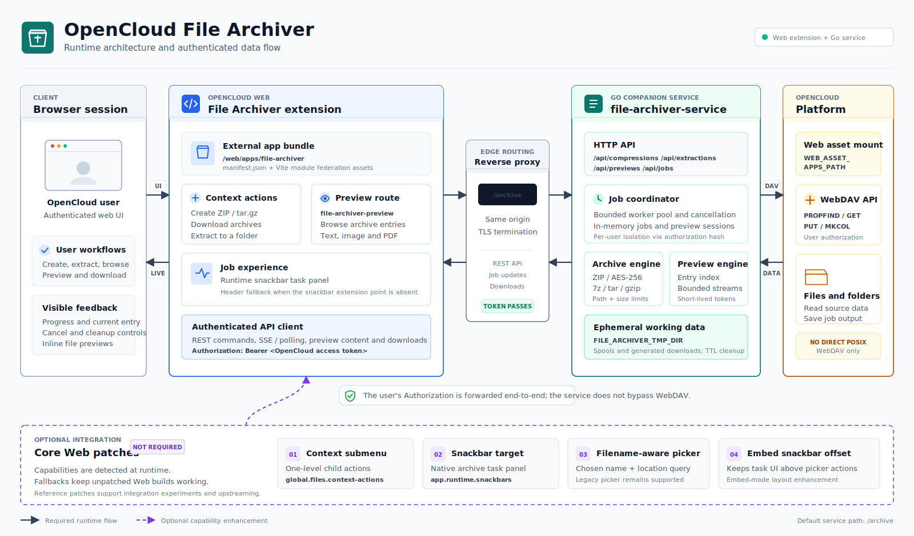

# OpenCloud File Archiver

The File Archiver Plugin many OpenCloud users have been waiting for.

OpenCloud can store, sync and share files beautifully. This plugin adds the missing archive
workflow: create archives from selected files, download archives directly, extract archives
back into OpenCloud, and inspect archive contents without leaving the web UI.

It is built as an OpenCloud Web extension plus a small companion service. The extension gives
users the archive actions where they already work. The service performs the heavy archive work
through WebDAV, using the user's own OpenCloud authorization.

## Highlights

- Create ZIP, encrypted ZIP and tar.gz archives from selected files or folders.
- Save generated archives into any folder chosen with the OpenCloud location picker.
- Download generated archives directly without first saving them back into OpenCloud.
- Extract supported archives into a selected target folder.
- Prompt for archive passwords when encrypted source archives require them.
- Browse archives like a lightweight file explorer before extracting them.
- Preview text, image and PDF entries inside supported archives.
- Extract or download individual entries from an archive preview.
- Track archive jobs with progress, current entry text, cancellation and cleanup controls.
- Automatically refresh the file list when a saved archive or extraction finishes.
- Suggest archive names and use keep-both conflict handling to avoid accidental overwrites.
- Works without Core Web patches; newer Core Web capabilities are used when present.

## Supported Formats

| Workflow | Formats |
| --- | --- |
| Create | ZIP, encrypted ZIP with AES-256, tar.gz |
| Extract | ZIP, 7z, tar, tar.gz, tgz, gz |
| Browse and preview | ZIP, 7z, tar, tar.gz, tgz, gz |
| Inline preview entries | Text, images and PDF files |

RAR and ZipCrypto are intentionally not supported.

## User Experience

The plugin registers archive actions in the normal files context menu:

- `Create ZIP archive...`
- `Create encrypted ZIP archive...`
- `Create tar.gz archive...`
- `Download ZIP archive`
- `Download encrypted ZIP archive`
- `Download tar.gz archive`
- `Extract to...`
- `Browse archive`

When the target OpenCloud Web build supports context action children, nested archive menus can
be enabled with `fileArchiverUseNestedActions: true`. Otherwise the plugin defaults to flat
actions so it remains compatible with current unpatched Web builds.

Archive jobs run in the background. Users can keep working while the plugin shows progress,
successful completion, failures, cancel buttons and clear buttons in the runtime snackbar area.
If the runtime snackbar extension point is not available, the plugin renders its own floating
task panel and keeps it out of the way of OpenCloud's own notifications.

## Security Model

The companion service is deliberately scoped:

- It uses the current user's OpenCloud `Authorization` header for all WebDAV reads and writes.
- It never writes directly to OpenCloud POSIX storage; all file access goes through WebDAV.
- Jobs and preview sessions are tied to the authorization that created them.
- Stored job secrets are cleared when jobs finish, fail or are cancelled.
- Generated download links use time-limited tokens scoped to the relevant job or preview entry.
- Direct archive downloads do not have to be saved into OpenCloud first.
- Archive paths are normalized and rejected if they contain absolute paths, Windows drive paths,
  UNC paths, backslash separators, control characters or path traversal.
- Archive entry counts, archive input size, extracted output size, single entry size and preview
  size are all bounded by configuration.
- The published container runs as a non-root `archiver` user.

This service should be deployed behind the same authenticated OpenCloud origin, typically routed
as `/archive`.

## Performance And Reliability

Archive work can be expensive, so the service is designed around explicit limits and background
jobs:

- A configurable worker limit controls concurrent archive jobs.
- Large generated archives are spooled through the service temp directory before upload or
  download.
- WebDAV request and header timeouts prevent stalled backend calls from hanging forever.
- Preview reads are size-limited so opening an archive does not imply streaming huge entries.
- Finished jobs expire after a configurable TTL.
- Cancellation propagates through the running job context.
- Default conflict handling keeps both files where the UI would otherwise overwrite a result.

Important defaults:

| Variable | Default |
| --- | --- |
| `FILE_ARCHIVER_MAX_CONCURRENT_JOBS` | `2` |
| `FILE_ARCHIVER_MAX_ARCHIVE_BYTES` | `20000000000` |
| `FILE_ARCHIVER_MAX_OUTPUT_BYTES` | `100000000000` |
| `FILE_ARCHIVER_MAX_ENTRY_BYTES` | `20000000000` |
| `FILE_ARCHIVER_MAX_PREVIEW_BYTES` | `50000000` |
| `FILE_ARCHIVER_MAX_ENTRIES` | `100000` |
| `FILE_ARCHIVER_DAV_REQUEST_TIMEOUT` | `6h` |
| `FILE_ARCHIVER_DOWNLOAD_TOKEN_TTL` | `10m` |
| `FILE_ARCHIVER_JOB_TTL` | `1h` |

See [file-archiver-service/README.md](file-archiver-service/README.md) for the full backend
configuration and API.

## Compatibility

Core Web patches are not required.

The extension has compatibility fallbacks for OpenCloud Web builds that do not yet provide every
native extension capability:

- It registers flat context actions by default instead of requiring action `children`.
- It asks for the archive filename itself if the location picker does not return `fileName`.
- It renders a floating archive task panel when `app.runtime.snackbars` is unavailable.

The [core-web-patches](core-web-patches) directory remains as optional reference material for
native integration experiments and upstreaming.

## Architecture



This repository is split into:

- [web-app-file-archiver](web-app-file-archiver): OpenCloud Web extension for actions, archive
  preview UI and job status UI.
- [file-archiver-service](file-archiver-service): Go companion service for compression,
  extraction, previews, progress and cancellation.
- [deploy](deploy): Docker Compose style deployment examples.
- [core-web-patches](core-web-patches): optional Core Web integration patches.

The default frontend service path is `/archive`. Override it with the app config property
`fileArchiverServiceUrl` when your deployment routes the companion service elsewhere.

## Quick Start

Build the web extension:

```sh
cd web-app-file-archiver
pnpm install
pnpm build
```

Deploy `web-app-file-archiver/dist` as:

```text
WEB_ASSET_APPS_PATH/file-archiver
```

Run the backend service image:

```text
ghcr.io/cheneyveron/opencloud-file-archiver-service:main
```

Route `/archive` to the service and configure the app:

```yaml
file-archiver:
  config:
    fileArchiverServiceUrl: /archive
    archivePollIntervalMs: 2000
```

See [deploy/README.md](deploy/README.md) for a Compose-style example.

## Local Development

Frontend:

```sh
cd web-app-file-archiver
pnpm install
pnpm test:unit
pnpm build
```

Backend:

```sh
cd file-archiver-service
go test ./...
PORT=8080 FILE_ARCHIVER_OPENCLOUD_URL=https://host.docker.internal:9200 go run ./cmd/file-archiver-service
```
